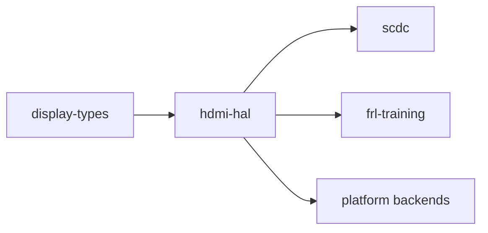

# hdmi-hal

[](https://github.com/DracoWhitefire/hdmi-hal/actions/workflows/ci.yml)
[](https://crates.io/crates/hdmi-hal)
[](https://docs.rs/hdmi-hal)
[](LICENSE)
[](https://blog.rust-lang.org/2025/02/20/Rust-1.85.0.html)

Hardware abstraction traits for the HDMI stack.

`hdmi-hal` defines the behavioral contracts between protocol logic and hardware. It is a
traits-only crate: no implementations live here. Every trait expresses an I/O boundary
that multiple crates in the stack need to cross in a compatible way — raw SCDC register
access over DDC/I²C, and PHY lane configuration for HDMI 2.1.

## Usage

```toml
[dependencies]
hdmi-hal = "0.2"
```

Implement a trait against your hardware backend:

```rust
use hdmi_hal::scdc::ScdcTransport;

struct MyI2cBackend { /* ... */ }

impl ScdcTransport for MyI2cBackend {
    type Error = MyError;

    fn read(&mut self, reg: u8) -> Result<u8, MyError> { /* ... */ }
    fn write(&mut self, reg: u8, value: u8) -> Result<(), MyError> { /* ... */ }
}
```

Accept a trait bound in consumer code:

```rust
use hdmi_hal::scdc::ScdcTransport;

fn configure_frl<T: ScdcTransport>(transport: &mut T) -> Result<(), T::Error> {
    transport.write(0x31, 0x01)?; // initiate FRL
    Ok(())
}
```

For a complete worked example of both traits with a simulated backend, see
[`examples/simulate`](examples/simulate/).

## Stack position

`hdmi-hal` sits between the platform backends and the protocol logic crates. It has no
dependency on the rest of the stack; protocol crates depend on it, not the reverse.



Async variants of both traits live in the companion crate `hdmi-hal-async`, following
the same split as `embedded-hal` / `embedded-hal-async`.

## Out of scope

- **Protocol logic** — SCDC register semantics, typed register wrappers, and the FRL
  link training state machine belong in the crates that consume `ScdcTransport`.
- **Implementations** — concrete platform backends (kernel I²C drivers, simulator
  harnesses, test doubles) live in the crates that use these traits.
- **PHY vendor backends** — hardware-specific register sequences belong in platform
  crates that implement `HdmiPhy`.
- **CEC or eARC protocol logic** — only the wire-access primitive will belong here;
  protocol state machines are in their own crates.

## Documentation

- [`doc/architecture.md`](doc/architecture.md) — trait surfaces, design principles, async story, and stack position
- [`doc/roadmap.md`](doc/roadmap.md) — planned features and future work

## License

Licensed under the [Mozilla Public License 2.0](LICENSE).
